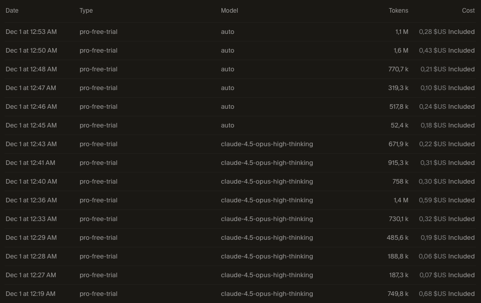

# 🦆 Canards

Un jeu de gestion de sanctuaire animalier minimaliste où vous restaurez et entretenez un écosystème lacustre. Concentrez-vous sur le bien-être animal, la biodiversité et le contrôle de la pollution — pas d'exploitation, seulement du soin.


## Utilisation de Cursor

En générant ce projet, j'ai identifié cette consommation de tokens :




## 🎮 Fonctionnalités

### Tableau de Bord (3/4 de l'écran)

- **Barre de ressources** : Jour, Énergie, Budget (€), Niveau de filtration, Santé de l'écosystème
- **3 Graphiques en temps réel** :
  - 💚 Bien-être Animal (santé et bonheur moyens)
  - 🌿 Biodiversité (nombre d'espèces)
  - ⚠️ Pollution (plastique et déchets)
- **Cartes d'animaux** avec statistiques détaillées :
  - 🦆 Canards : Santé, bonheur, population, nichoirs
  - 🐟 Poissons : Santé, bonheur, diversité des espèces
  - 🪰 Libellules : Indicateur de pureté de l'eau
  - 🌿 Plantes Aquatiques : Production d'oxygène, couverture

### Actions Disponibles

| Action | Description | Coût |
|--------|-------------|------|
| 🍞 Nourrir Canards | Augmente le bonheur des canards | ⚡10 💰5 |
| 🧹 Nettoyer Lac | Réduit la pollution | ⚡25 💰10 |
| 🏠 Construire Nichoir | Augmente la population de canards | ⚡40 💰50 |
| 🔬 Rechercher Médecine | Débloque les soins | ⚡30 💰100 |
| 💊 Soigner Animaux | Restaure la santé (requiert recherche) | ⚡20 💰15 |
| 🔧 Améliorer Filtration | Réduit la pollution automatiquement | ⚡50 💰75 |
| 🌱 Planter Végétation | Augmente l'oxygène | ⚡15 💰20 |
| 🐟 Ajouter Poissons | Nouvelles espèces | ⚡20 💰30 |

### Vue du Lac 3D (1/4 de l'écran)

- Scène Three.js isométrique avec animations :
  - Canards nageant
  - Poissons sautant
  - Libellules volant
  - Plantes ondulant
- Effets visuels lors des actions (ondulations lors du nettoyage)
- Contrôles orbitaux pour faire tourner la vue
- **Interactivité** : Cliquez sur un canard pour le caresser et voir des cœurs animés ! ❤️

## 🛠️ Technologies

- **Next.js 14** (App Router)
- **React 18** + **TypeScript**
- **Tailwind CSS** avec thème personnalisé
- **Chart.js** + react-chartjs-2 pour les graphiques
- **Three.js** + @react-three/fiber pour la scène 3D
- **Zustand** pour la gestion d'état
- **localStorage** pour la persistance des données

## 🚀 Tester Localement

### Prérequis

- Node.js 18+ installé
- npm ou yarn

### Installation

```bash
# Cloner le dépôt
git clone git@github.com:dimitri-bourreau/canards.git
cd canards

# Installer les dépendances
npm install

# Lancer le serveur de développement
npm run dev
```

Ouvrez [http://localhost:3000](http://localhost:3000) dans votre navigateur.

### Scripts Disponibles

```bash
npm run dev      # Serveur de développement
npm run build    # Build de production
npm run start    # Lancer la build de production
npm run lint     # Vérifier le code
```

## 🎯 Comment Jouer

1. **Gérez vos ressources** : L'énergie se régénère automatiquement, le budget augmente grâce aux dons
2. **Prenez soin des animaux** : Nourrissez les canards, soignez les malades
3. **Protégez l'environnement** : Nettoyez le lac, améliorez la filtration
4. **Développez l'écosystème** : Plantez de la végétation, ajoutez des espèces
5. **Surveillez les indicateurs** : Maintenez un bon niveau de bien-être et de biodiversité
6. **Interagissez** : Survolez les éléments pour voir des tooltips informatifs, cliquez sur les canards dans le lac !

## 📝 Licence

MIT

---

*Canards • Un jeu sur le soin, pas l'exploitation 💚*
